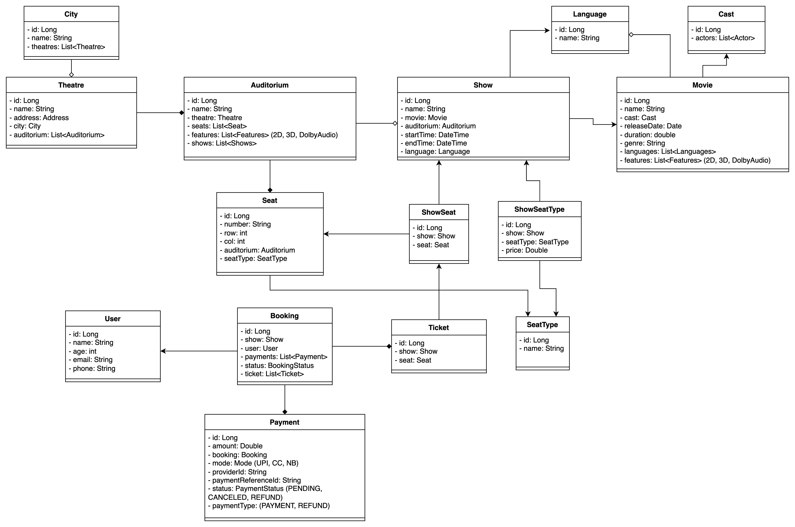
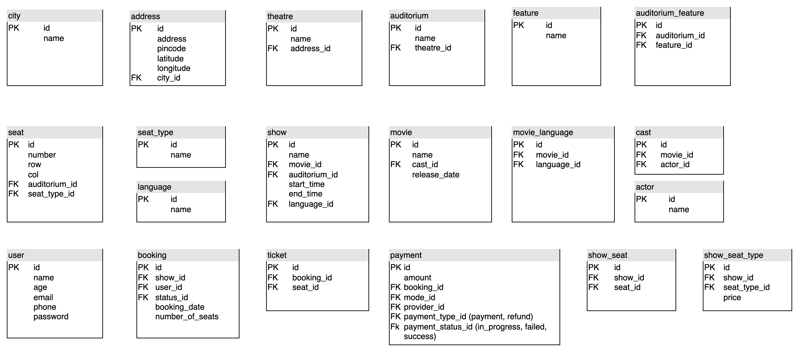

# Book My Show - Low Level Design

## Functional Requirements

* Support multiple cities.
* Display different movies shows in different cities.
* For a given city, display available theatres and shows in those theatres.
* One city can have multiple theatres.
* One theatre can have multiple auditoriums.
* One audi will have multiple seats.
* Seats can be of different type:
  * SILVER
  * GOLD
  * PLATINUM
* Theatres should be able to name their seat types.
* Price of a seat depends on the time of the show, theatre and type of the seat.
* One user can select maximum 10 seats at a time.
* Different auditorium can have different seat structure.
* No admin functionality in this version.
* Store cast and rating information of a movie:
  * Rating
  * Duration
  * Features (2D, 3D, IMAX, Doubly, Subtitles)
  * Language
  * Cast
* Only allow booking before 30 minutes of the show-time.
* Booking allowed for one show at a time.
* Can have different seat type in the same booking
* User can cancel ticket and get refund.

## Entity Identification

* City
* Theatre
* Auditorium
* Seat
* SeatType
* Show
* Movie
* Cast
* Language
* User
* Booking
* Ticket
* Payment
* Show_Seat
* ShowSeatType

## Class Diagram

## Schema Design

