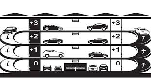
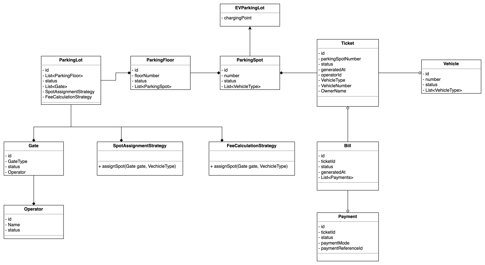
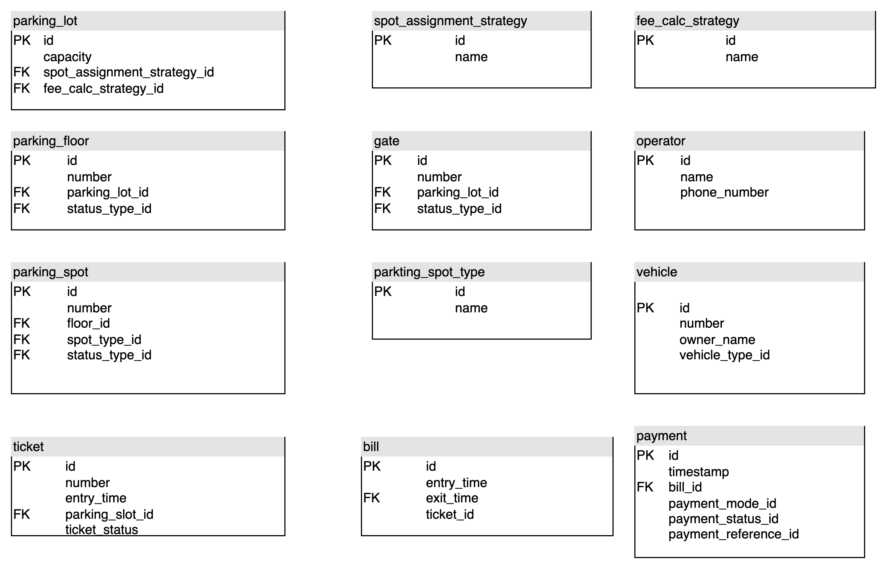

# Parking Lot - Low Level Design

## Function Requirements

* Multilevel parking lot.
* Multiple types of parking slots for types of vehicle.
* Token for a parking spot will be allocated at the time of entry.
* Parking fee should be calculated at the time of exit using token.
* EV parking slots should be supported.
* Payment calculation should be dynamic and system should allow to change payment easily.
* Multiple modes of payment: Cash, UPI, CC, Netbanking, FastTag.
* Support for multiple entry and exit gates.
* Operators are present at entry and exit gates.
* Operators should be able to check the available slots and collect payments.
* Assign the right type and size of slot to a vehicle.
* In one ticket, there can be multiple payment for different modes.

## Class Design

## Schema Design

