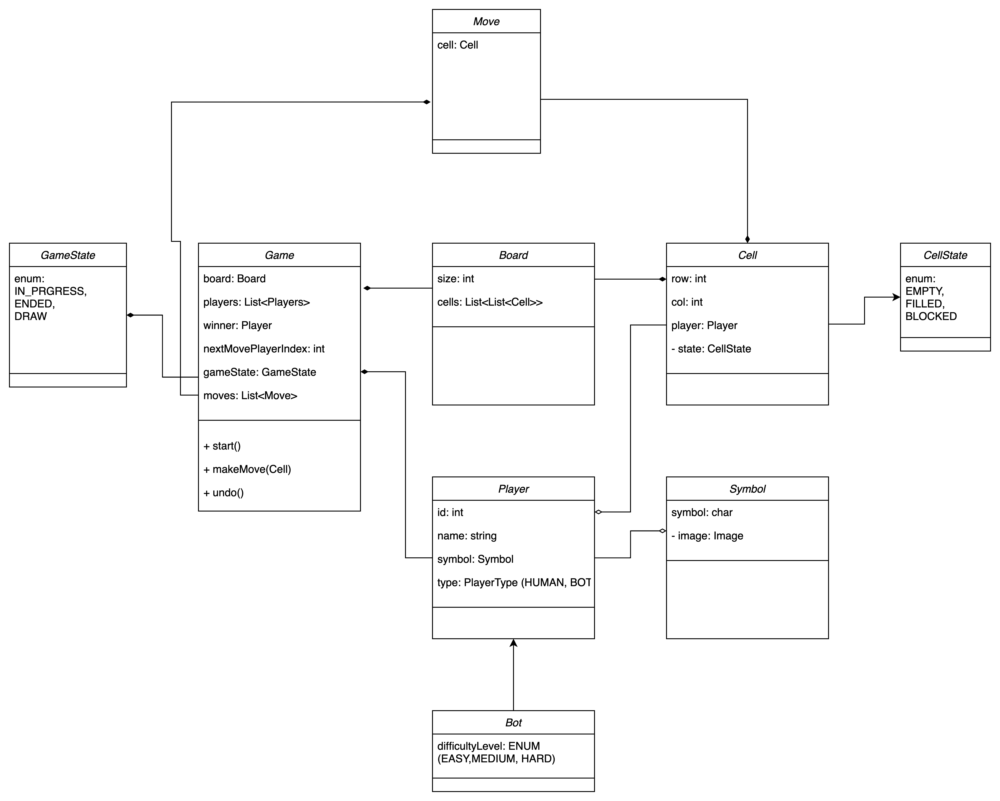

# Tick Tac Toe: Low Level Design

## Functional Requirements

* It should be an interactive system.
* Board size can be NxN.
* Number of players will be N-1.
* Players can choose their own unique symbol at the start of the game.
* There should be a BOT option for players.
* Only one BOT should be allowed.
* BOT can play in 3 difficulty levels: EASY, MEDIUM, HARD.
* First move should be decided by randomizing all the players in the beginning of the game.
* Game ends as soon as any player wins the game or game draws.
* Winning condition: Player gets same symbol across any row or column or diagonal.
* Support a global UNDO operation to move the last state the game was.

## Entities

1. Game
2. Board
3. Cell
4. CellState: EMPTY, FILLED, BLOCKED.
5. Move: represents a move in the game.
6. Player 
7. Symbol 
8. GameState: IN_PROGRESS, ENDED, DRAW 
9. BOT: is a plyer 
10. PlayerType 
11. DifficultyLevel: EASY, MEDIUM, HARD. 
12. Cell

## Class Diagram

## Design Patterns Used

### Builder Pattern

* `Game` class has many attributes and requires validations while creating object. Hence, Builder pattern can be used to create its objects.

### Strategy Pattern

* `Bot` player can have different algorithms to make its move depending on the difficulty level selected.
   So, strategy pattern can be used to create separate strategy for each of the difficulty level.
    
    

* Similarly, there can be multiple algorith to decide the game winning/draw case. So strategy pattern can be used for the same. 